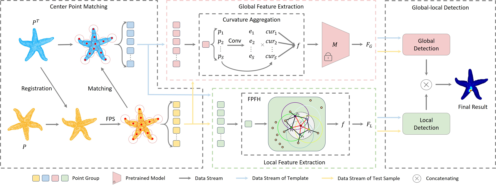

# Template3D-AD: Point Cloud Template Matching Method Based on Center Points for 3D Anomaly Detection

Yi Liu*, Changsheng Zhang*, Yufei Yang

(* Corresponding authors)

Our paper has been accepted by IJCAI 2025

# Overview
This paper proposes Template3D-AD, the first 3D anomaly detection method based on template matching.


# Data preparation
`run save_fpfh.py`

`voxel_size = 0.25` for Real3D-AD dataset and `voxel_size = 0.25` for Anomaly-ShapeNet-v2 dataset

# Run
`run main.py`

## Acknowledgments.
This work is supported by the Fundamental Research Funds for the Central Universities (N25BSS022) and the Ningxia Natural Science Foundation (2024AAC03349).

Our benchmark is built on [M3DM](https://github.com/nomewang/M3DM) and [Real3D-AD](https://github.com/M-3LAB/Real3D-AD), thanks their extraordinary works!

## BibTex Citation

If you find this paper and repository useful, please cite our paper☺️.

```
@inproceedings{liu2025template3d,
  title={Real3D-AD: A Dataset of Point Cloud Anomaly Detection},
  author={Liu, Yi and Zhang, Changsheng and Yang, Yufei},
  booktitle={34th International Joint Conference on Artificial Intelligence},
  year={2025}
}
```
